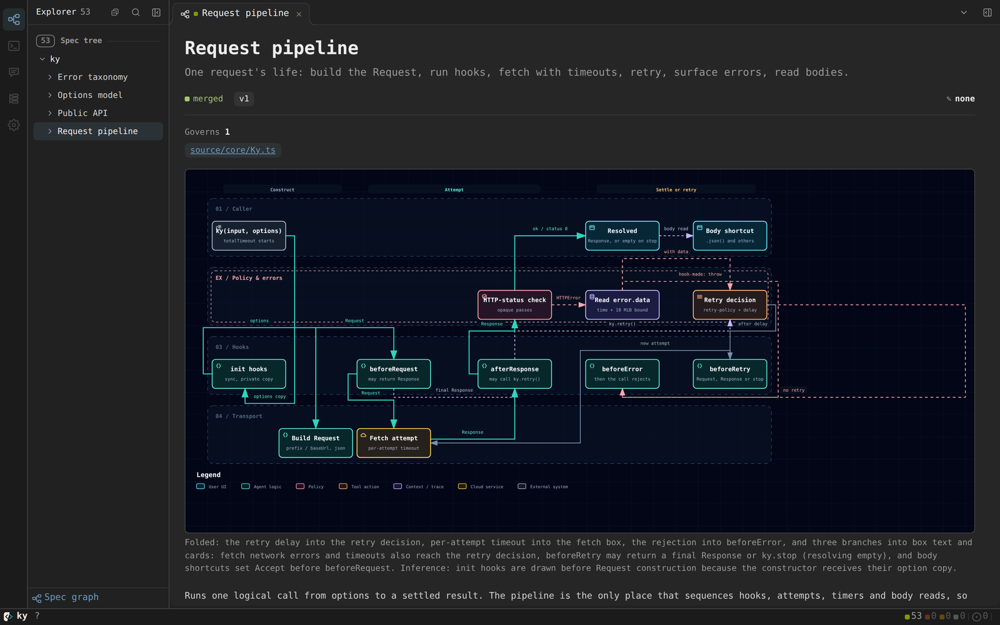

<div align="center">


<p>
  <a href="https://www.npmjs.com/package/spexcode"></a>
  
  
  <a href="https://spexcode.net"></a>
</p>

English · [中文](docs/README.zh-CN.md)

</div>

SpexCode is a Git-backed spec tree and session manager for coding agents.

It is built around one problem: spec drift. Agents change code faster than anyone updates the documents that say what the code is for, and nothing tells you when a spec stopped describing the system. In SpexCode each spec names the file or function it governs. When a later commit changes that code and leaves the spec alone, SpexCode names the spec and the commit. With the hooks installed, a change inside an anchored function is blocked until someone updates the spec or records why it still holds.

Sessions run each agent in its own branch and worktree, so every change comes back with the specs it touched named in its commits.

A spec node is a `spec.md` under `.spec/`. Its `code:` field names the implementation:

```yaml
---
title: Webhook security
code:
  - src/ingest/webhookVerifier.ts#verifyWebhook
---
Only a push signed with the configured SHA-256 secret may change a release stream.
```

That line is the whole binding. Versions, drift and history are computed from git on every read; nothing else is stored.

## Start from the agent you already use

You can try SpexCode from Claude Code or Codex before installing the CLI. The **atlas** plugin reads a repository, writes an initial spec tree, checks its diagrams and hands back one page you can open.

```sh
# Claude Code
claude plugin marketplace add shuxueshuxue/spexcode-plugins
claude plugin install atlas@spexcode
# Codex
codex plugin marketplace add shuxueshuxue/spexcode-plugins
codex plugin add atlas@spexcode
```

Then, inside any repository, run `/atlas`.

The plugin uses `spex init --pure` for the first adoption: plain `.spec/` files in git, no hooks and no agent configuration. You can add the session layer later with the CLI below.



More repositories drawn this way: [flatcode.spexcode.net](https://flatcode.spexcode.net/). Diagrams are rendered by [archify](https://github.com/tt-a1i/archify) (MIT).

## Computable spec drift

Each spec version is a commit that touched its `spec.md`; the window starts at the latest version. For every later commit, Git supplies the lines that commit changed, and SpexCode intersects them with the anchored unit's line range as it existed in that commit.


An intersection is `anchor-drift`: an error, and with the hooks installed the candidate commit is rejected. A change elsewhere in the same file is only a drift warning. The result is a deterministic computation.


Everything comes from Git; SpexCode stores no drift data. There are two ways to close the window: update the spec with the code, so the new spec version closes it, or record that the contract still holds with a `Spec-OK` trailer or `spex spec ack`.

```sh
spex spec lint
```

With the installed hooks, an anchored hit rejects a new candidate commit. Update the spec with the code, or record why an implementation-only change still satisfies the contract:

```sh
git commit --trailer "Spec-OK: webhook-security"
```

For a change that is already committed:

```sh
spex spec ack webhook-security --reason "the contract still holds; this refactor preserves it"
```


## Use it in the GUI


## Use it in the terminal


Everything the dashboard does is also a CLI verb; `spex help` lists them.

## Git or notebook? Intuitive spec management

Specs are Markdown files in git, and the dashboard reads them as documents you can act on.

<table>
<tr>
<td width="50%"></td>
<td width="50%"></td>
</tr>
<tr>
<td>A live session's edit to this spec, as a redline.</td>
<td>A selected passage, sent to a session.</td>
</tr>
</table>

## Quick start from a shell

Requires **Node ≥ 22** and **git**.

```sh
npm i -g spexcode
cd your-repo
spex init --harness claude,codex,opencode,pi,zcode,claude-headless,opencode-headless,pi-headless,codex-headless
```

The example lists every built-in harness; keep the ones you use (any one id or a comma-separated subset). `spex init` seeds the spec tree, installs hooks and materializes workflow instructions into the files your agent already reads. Existing configuration is preserved; `spex uninstall` removes SpexCode's additions.

<details>
<summary><strong>Adopt less</strong></summary>

| Command | Result |
| :--- | :--- |
| `spex init --pure` | Root spec and project config; no hooks. |
| `spex init --harness none` | Spec workflow and hooks; no agent configuration. |
| `spex init --harness …` | Spec workflow plus instructions for selected agents. |

Add `--title "Your Project"` to name the root spec and dashboard.

</details>

<details>
<summary><strong>Run isolated sessions</strong></summary>

Session management requires **tmux**; on Windows use **WSL2**.

```sh
spex session new "[[webhook-security]] verify signatures behind a reverse proxy"
spex session ls
spex session review <session-id>
spex session merge <session-id>
```

Workers propose. You decide when to request the gated merge.

</details>

<details>
<summary><strong>Open the dashboard</strong></summary>

```sh
npm i -g @spexcode/spec-dashboard
spex serve
spex dashboard
```

Each project has a backend; one dashboard serves all projects on the machine. Spec, session and terminal views have shareable URLs.

</details>

## Three layers


[Setup guide](https://spexcode.net/getting-started/) · [Working with agents](https://spexcode.net/working-with-agents/) · [Contributing](docs/CONTRIBUTING.md)

First introduced on [LINUX DO](https://linux.do). Licensed under [MIT](LICENSE).
