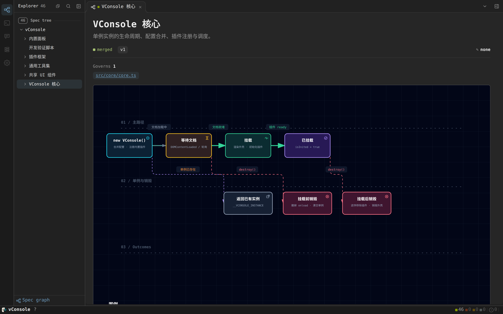
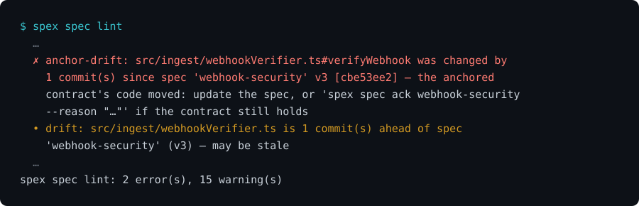
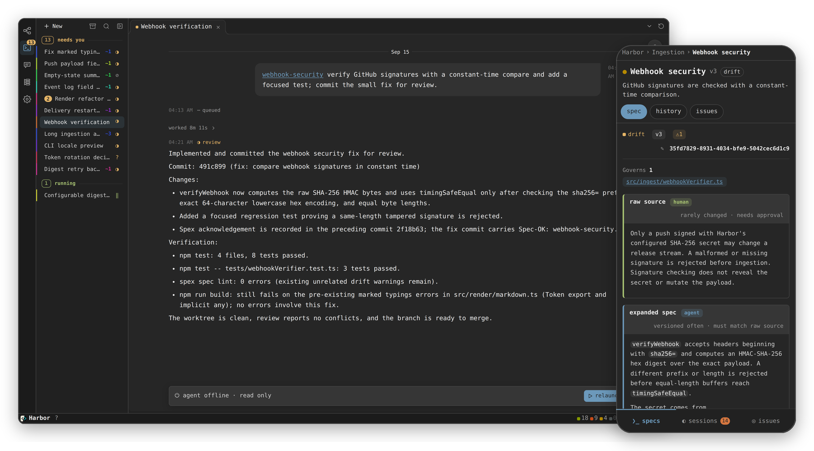
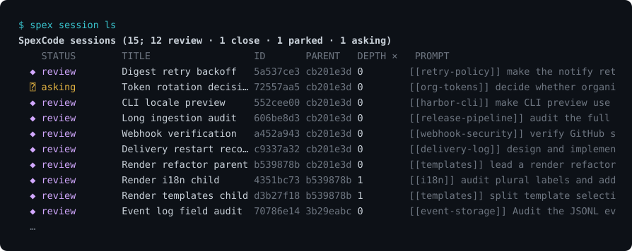
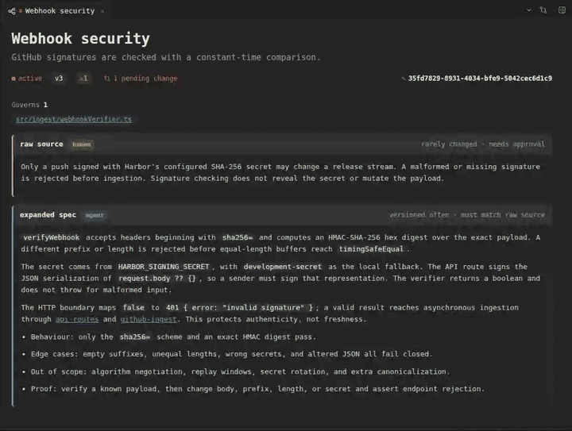
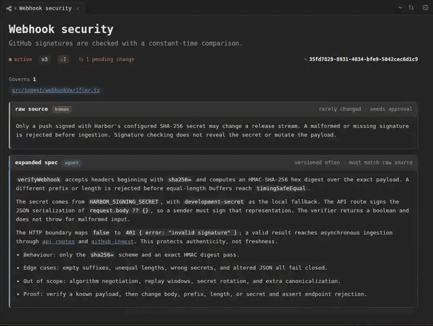

<div align="center">


<p>
  <a href="https://www.npmjs.com/package/spexcode"></a>
  
  
  <a href="https://spexcode.net"></a>
</p>

[English](../README.md) · 中文

</div>

SpexCode 是一个基于 git 的 spec 树和 coding agent 会话管理器。

你写下软件应该做什么，让 agent 去实现，再对照这份意图 review 它们的改动。

每个 spec 可以指向它管辖的文件或函数。之后的 commit 改了这个目标、却没有更新 spec，SpexCode 就把它报出来等你 review。session 给每个 agent 一个隔离的分支和 worktree，并记录它交回了什么。

一个 spec 节点就是 `.spec/` 下的一个 `spec.md`。它的 `code:` 字段写明实现在哪：

```yaml
---
title: Webhook security
code:
  - src/ingest/webhookVerifier.ts#verifyWebhook
---
Only a push signed with the configured SHA-256 secret may change a release stream.
```

`code:` 这一行就是绑定。之后哪个 commit 改了 `verifyWebhook`，SpexCode 都能指出需要 review 的是哪个节点，这次改动不会埋在历史里。

## 从你正在用的 agent 开始

装 CLI 之前，可以先在 Claude Code 或 Codex 里试。**atlas** 插件会读整个仓库，写出第一版 spec 树，检查每张图，最后交回一个能直接打开的页面。

**Claude Code**

```sh
claude plugin marketplace add shuxueshuxue/spexcode-plugins
claude plugin install atlas@spexcode
```

**Codex**

```sh
codex plugin marketplace add shuxueshuxue/spexcode-plugins
codex plugin add atlas@spexcode
```

然后在任意仓库里说一句：

```text
画出这个仓库的 spec atlas，给我一个能打开的页面。
```

插件第一次引入用的是 `spex init --pure`：只有 git 里的 `.spec/` 纯文件，不装钩子，不改 agent 配置。以后要用 session 层，再用下面的 CLI 加上。



更多这样画出来的仓库：[flatcode.spexcode.net](https://flatcode.spexcode.net/)。图由 [archify](https://github.com/tt-a1i/archify)（MIT）渲染。

## 函数被改了，就成为一个 review 项

之后某个 commit 改了 `verifyWebhook` 里的行，测试可能照样全绿。SpexCode 会把这个 commit 变成一个有名字的 review 项：



改到文件的其它地方只是提醒；改到 `verifyWebhook` 里面就会阻断。SpexCode 不判断新的校验逻辑好不好，它只保证是哪个函数、哪个 commit，不会在 review 队列里丢掉。


窗口从 spec 的上一版开始。之后的每个 commit，都拿它改动的行去和被锚定函数在那个 commit 时的行区间求交。只要有重叠就报错，直到 spec 更新，或者有人签字确认。

```sh
spex spec lint
```

装了钩子以后，命中锚点的新 commit 会被拒绝。要么把 spec 和代码一起改，要么写明为什么这次只改实现、契约仍然成立：

```sh
git commit --trailer "Spec-OK: webhook-security"
```

已经提交的改动用：

```sh
spex spec ack webhook-security --reason "契约仍然成立，这次重构没有改变它"
```


## 在图形界面里用



## 在终端里用



dashboard 能做的事，CLI 都有对应的命令；`spex help` 会列出全部。

## Git 还是笔记本？直观的 spec 管理

spec 是 git 里的 Markdown 文件，dashboard 把它们当成可以直接操作的文档来读。

<table>
<tr>
<td width="50%"></td>
<td width="50%"></td>
</tr>
<tr>
<td>运行中的 session 对这份 spec 的修改，以红线对比呈现。</td>
<td>选中一段话，发给某个 session。</td>
</tr>
</table>

## 快速开始

需要 **Node ≥ 22** 和 **git**。

```sh
npm i -g spexcode
cd your-repo
spex init --harness claude,codex,opencode,pi,zcode,claude-headless,opencode-headless,pi-headless,codex-headless
```

示例列出了全部内建 harness，留下你用的就行（任意一个 id 或逗号分隔的子集）。`spex init` 会种下 spec 树、安装钩子，并把工作流说明写进你的 agent 本来就会读的文件。已有配置不会被覆盖；`spex uninstall` 会移除 SpexCode 加的东西。

<details>
<summary><strong>只引入一部分</strong></summary>

| 命令 | 结果 |
| :--- | :--- |
| `spex init --pure` | 只有根 spec 和项目配置，不装钩子。 |
| `spex init --harness none` | spec 工作流和钩子，不改 agent 配置。 |
| `spex init --harness …` | spec 工作流，外加给所选 agent 的说明。 |

加 `--title "你的项目名"` 给根 spec 和 dashboard 命名。

</details>

<details>
<summary><strong>运行隔离的 session</strong></summary>

session 管理需要 **tmux**；Windows 上请用 **WSL2**。

```sh
spex session new "[[webhook-security]] verify signatures behind a reverse proxy"
spex session ls
spex session review <session-id>
spex session merge <session-id>
```

worker 只提议，什么时候发起受闸门保护的合并由你决定。

</details>

<details>
<summary><strong>打开 dashboard</strong></summary>

```sh
npm i -g @spexcode/spec-dashboard
spex serve
spex dashboard
```

每个项目一个后端，一台机器一个 dashboard 服务所有项目。spec、session 和终端视图都有可分享的 URL。

</details>

## 三层


SpexCode 不提供编码模型，也不判断改动对不对。它记录意图，度量代码相对意图的移动，并给由此产生的工作一个 review 的地方。

[上手指南](https://spexcode.net/getting-started/) · [和 agent 一起工作](https://spexcode.net/working-with-agents/) · [参与贡献](CONTRIBUTING.md)

首发于 [LINUX DO](https://linux.do)。以 [MIT](../LICENSE) 许可发布。
